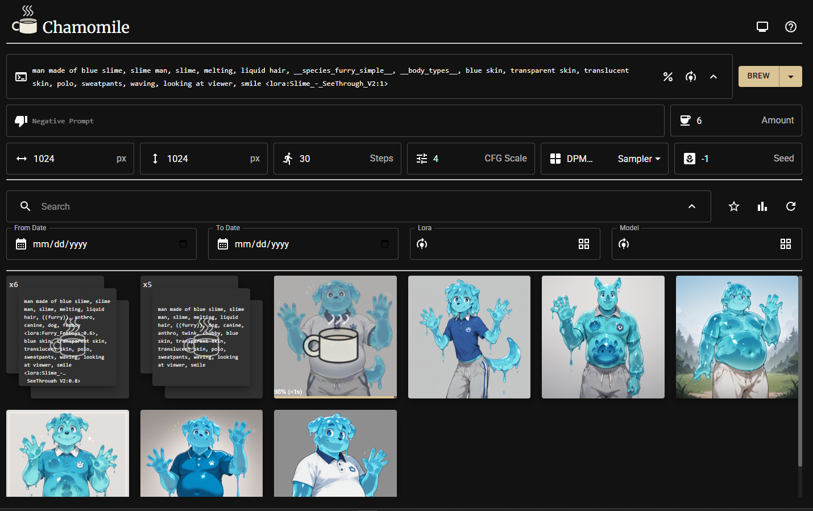

Chamomile is a wrapper for Automatic1111, that leverages its API function to make it easy to browse and generate images with StableDiffusion.

## Key Features

    <b>Better Queue</b>
    
Chamomile lets you more easily review pending prompts, and cancel them individually. Now one bad prompt doesn't mean interrupting everything.

    <b>Powerful Search</b>
    
Chamomile lets you search your generated images by query string, LoRA, model, and date. No more file lookup and organization nightmares.

    <b>Reusable Recipes</b>
    
Chamomile lets you save prompts as "Recipes" to make it easy to generate more of what you like. Additionally, you can instantly reuse a prompt from any image saved

    <b>Variables and Comments</b>
    
Chamomile lets you anotate your prompts with comments (#, //, or /**/), as well as specify variables to make it easier to quickly edit your prompts.

## Requirements
- A Postgres DB
- An Automatic1111 Instance with API access

## Setup
- Create "Chamomile" schema and apply [Tables.sql](./Chamomile.Data/DDLs/Tables.sql)
- Set DB_URL to a connection string:
    - IE: Host=localhost:5432;Database=chamomile;Username=chamomile;Password=(pass);
- Set SD_URL to your Automatic1111 instance
    - IE: http://127.0.0.1:7860
- Configure your Automatic1111 
    - Add --api to your COMMANDLINE_ARGS on webui-user
- Run

## Yet to Support
[-] Additional Samplers/Schedulers
    -> Samplers added, scheduler support is available but is hidden to avoid clutter
[ ] Scripts
[ ] Img2Img
[ ] Inpainting
[X] Statistics

## Remember to support an artist
Generating is nice as a reference, but if you want to get a real image, try commissioning an artist. <3

