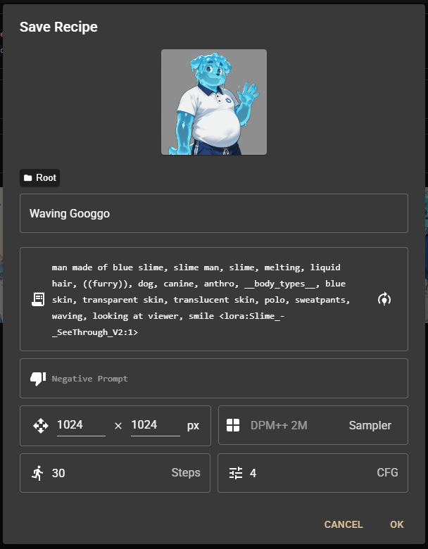
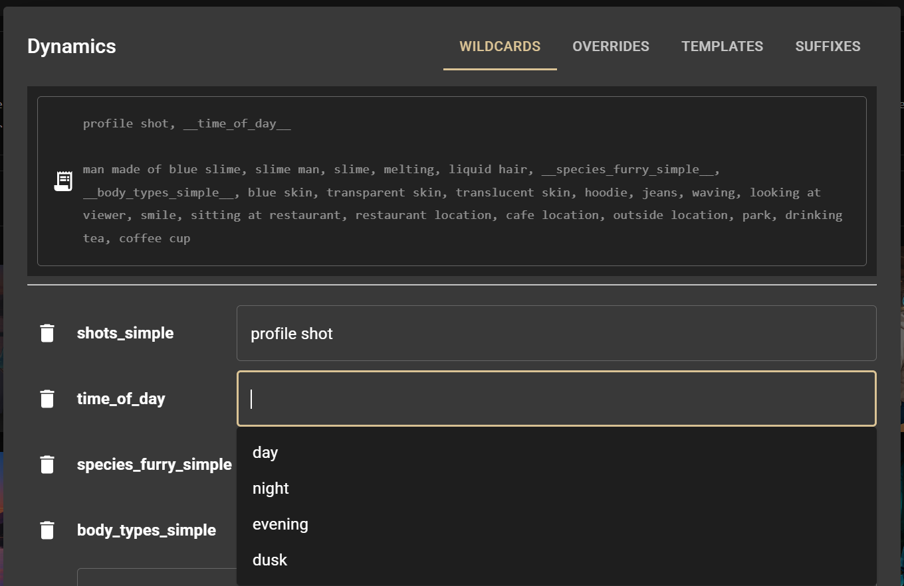
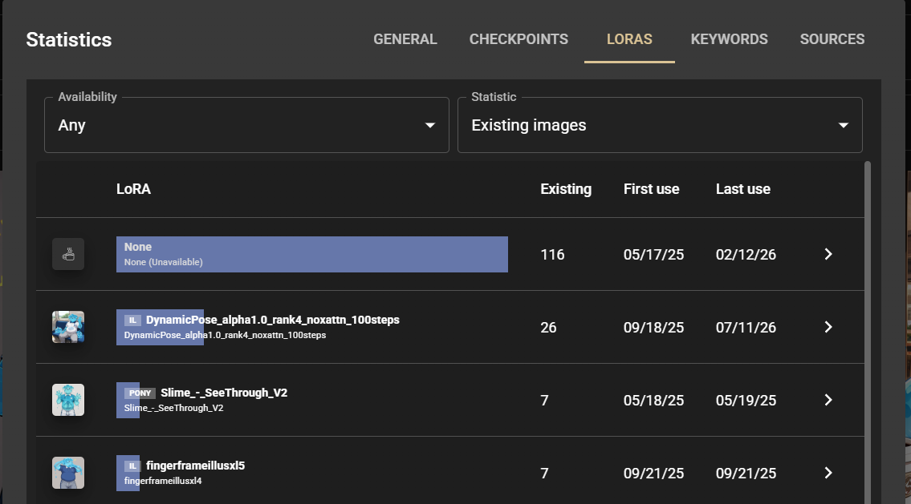

Chamomile is a wrapper for Automatic1111, that leverages its API function to make it easy to browse and generate images with StableDiffusion.

## Key Features
### Better Queue
Chamomile lets you more easily review pending prompts, and cancel them individually. Now one bad prompt doesn't mean interrupting everything.

### Powerful Search
Chamomile lets you search your generated images by query string, LoRA, model, and date. No more file lookup and organization nightmares. Chamomile also supports
advanced TsQuery search on your images, making it even easier to search by tags and sections of text. You can even migrate your existing collection of images
to Chamomile and they will be automatically saved and catalogued.

### Reusable Recipes

Chamomile lets you save prompts as "Recipes" to make it easy to generate more of what you like. Additionally, you can instantly reuse a prompt from any image saved.

### Advanced Querying

Chamomile lets you annotate your prompts with comments (#, //, or /**/), as well as look over and specify wildcards to make it easier to quickly edit your prompts.
You can then view and search by either the full prompt that was generated, or the base prompt with all wildcards un-replaced, and comments still intact.

### Statistics

Chamomile lets you dig into your usage patterns, by giving you statistics on all your images, or those that match your search query. You can also limit by latest
images or by Checkpoint/LoRA availability.

### And a bit more!
You can find more on how to use and get started with Chamomile in the included in the help and about documentation 

## Requirements
- A Postgres DB
- An Automatic1111 Instance with API access

## Setup
- Create "Chamomile" schema and apply [Tables.sql](./Chamomile.Data/DDLs/Tables.sql)
- Set DB_URL to a connection string:
    - IE: Host=localhost:5432;Database=chamomile;Username=chamomile;Password=(pass);
- Set SD_URL to your Automatic1111 instance
    - IE: http://127.0.0.1:7860
- Configure your Automatic1111 
    - Add --api to your COMMANDLINE_ARGS on webui-user
- Run

## Yet to Support
- [x] Additional Samplers/Schedulers
    -> Samplers added, scheduler support is available but is hidden to avoid clutter
- [ ] Scripts
- [ ] Img2Img
- [ ] Inpainting
- [X] Statistics

## Remember to support an artist
Generating is nice as a reference, but if you want to get a real image, try commissioning an artist. <3

